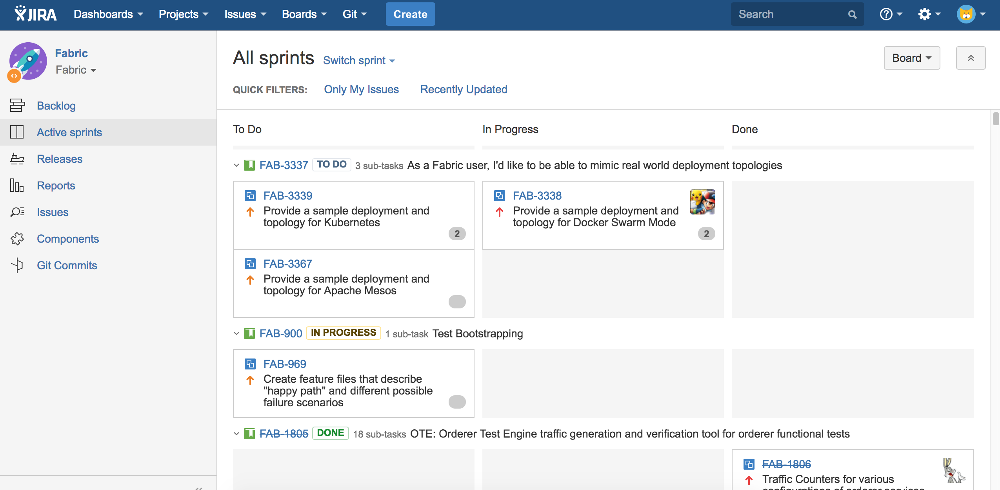
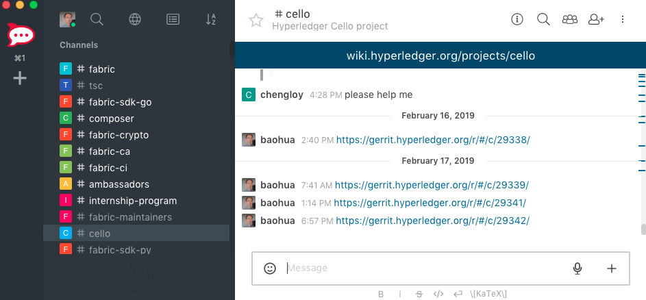

# 开发必备工具

工欲善其事，必先利其器。开源社区提供了大量易用的开发协作工具。掌握好这些工具，对于高效的开发来说十分重要。

## Linux Foundation ID

超级账本项目受到 Linux 基金会的支持，采用 Linux Foundation ID（LF ID）作为社区唯一的 ID。

个人申请 ID 是完全免费的。可以到 https://identity.linuxfoundation.org/ 进行注册。

用户使用该 ID 即可访问到包括 Jira、RocketChat 等社区的开发工具。

## Jira - 任务和进度管理

Jira 任务管理

Jira 是 Atlassian 公司开发的一套任务管理和事项跟踪的追踪平台，提供 Web 操作界面，使用十分方面。

社区采用 jira.hyperledger.org 作为所有项目开发计划和任务追踪的入口，使用 LF ID 即可登录。

登录之后，可以通过最上面的 Project 菜单来查看某个项目相关的事项，还可以通过 Create 按钮来快速创建事项（常见的包括 task、bug、improvement 等）。

用户打开事项后可以通过 assign 按钮分配给自己来领取该事项。

一般情况下，事项分为 TODO（待处理）、In Process（处理中）、In Review（补丁已提交、待审查）、Done（事项已完成）等多个状态，由事项所有者来进行维护。

## Github - 代码仓库和 Review 管理

Github 代码仓库管理

Github 是全球最大的开源代码管理仓库服务，微软公司于 2018 年 7 月以 75 亿美金价格纳入旗下。

超级账本社区目前所有项目都通过 Github 进行管理。早期 Fabric、Cello、Explorer 等项目采用了自建的 Gerrit 服务作为官方的代码仓库，2019 年下半年也都陆续迁移到了 Github 服务器上。

用户使用自己的账号登录之后，可以查看所有项目信息，也可以查看自己提交的补丁等信息。每个补丁的页面上会自动追踪修改历史，审阅人可以通过页面进行审阅操作，赞同提交则可以批准，发现问题则可以进行批注。

## RocketChat - 在线沟通

RocketChat 在线沟通

除了邮件列表外，社区也为开发者们提供了在线沟通的渠道—— RocketChat。

RocketChat 是一款功能十分强大的在线沟通软件，支持多媒体消息、附件、提醒、搜索等功能，虽然是开源软件，但在体验上可以跟商业软件 Slack 媲美。支持包括网页、桌面端、移动端等多种客户端。

社区采用 chat.hyperledger.org 作为服务器。最简单的，用户直接使用自己的 LF ID 登录该网站，即可访问。之后可以自行添加感兴趣项目的频道。

用户也可以下载 RocketChat 客户端，添加 chat.hyperledger.org 作为服务器即可访问社区内的频道，跟广大开发者进行在线交流。

通常，每个项目都有一个同名的频道作为主频道，例如 `#Fabric`，`#Cello` 等。同时，各个工作组也往往有自己的频道，例如大中华区技术工作组的频道为 `#twg-china`。

## 邮件列表 - 常见渠道

各个项目和工作组都建立了专门的邮件列表，作为常见的交流渠道。当发现问题不知道往哪里报告时，可以先发到邮件列表进行询问，一般都能获得及时的回答。

例如，大中华区技术工作组的频道为 `twg-china@lists.hyperledger.org`。

用户在 https://lists.hyperledger.org/g/main/subgroups 看到社区已有的邮件列表并选择加入。

## 提问的智慧

为什么我在社区提出的问题会过了很长时间也无人回应？

开源社区是松散自组织形式，大部分开发者都是利用业余时间进行开发和参与社区工作。因此，在社区提出问题时就必须要注意问题的质量和提问的方式。碰到上述情况，首先要先从自身找原因。

如果能做到下面几点，会使你提出的问题得到更多的关注：

- 正确的渠道：这点十分重要。不同项目和领域有各自的渠道，一定要在相关的渠道进行提问，而不要问跟列表主题不相关的话题，例如，每个项目相关问题应该发送到对应的邮件列表。
- 问题的新颖性：在提问之前，应该利用包括搜索引擎、技术文档、邮件列表等常见方式进行查询，确保提出的问题是新颖的，有价值的，而不是已经被回答过多遍的常识性问题。
- 适当的上下文：不少提问者的问题中只包括一条很简单的错误信息，这样会让社区的开发者有心帮忙也无力回答。良好的上下文包括完整的环境信息、所使用的软件版本、所进行操作的详细步骤、问题相关的日志、自己对问题的思考等。这些都可以帮助他人快速重现问题并帮忙回答。
- 注意礼仪：虽然技术社区里大家沟通方式会更为直接一些，但懂得礼仪毫无疑问是会受到欢迎的。要牢记，别人的帮助并非是义务的，要对任何来自他人的帮助心存感恩。