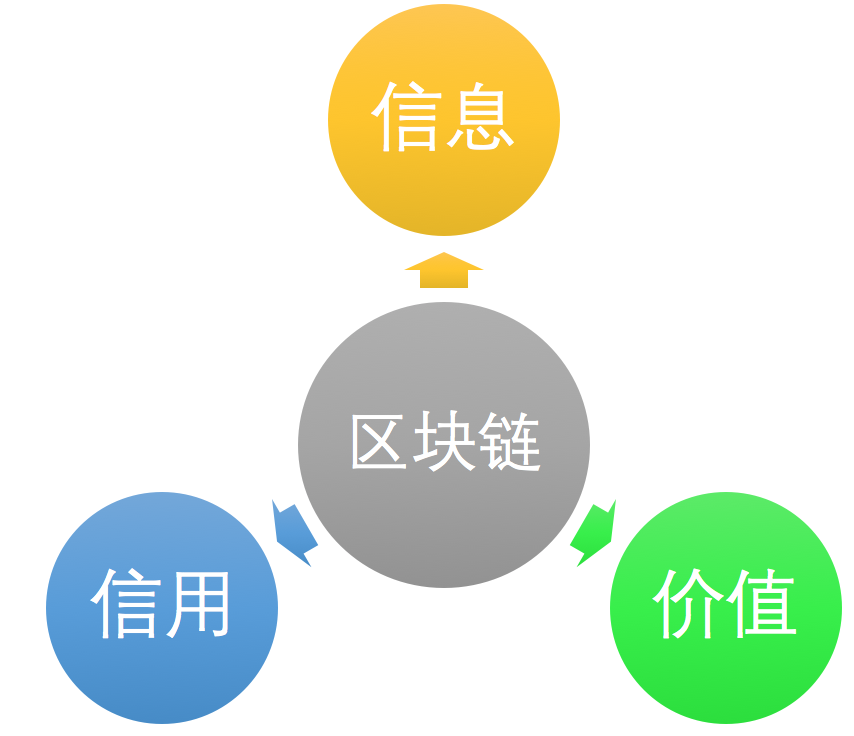

## 区块链的商业价值

商业行为的典型过程为：交易多方通过协商确定商业合约，通过执行合约完成交易。区块链擅长的正是如何在多方之间达成合约，并确保合约的顺利执行。

根据类别和应用场景不同，区块链所体现的特点和价值也不同。

从技术角度，一般认为，区块链具有如下特点：

* 分布式容错性：分布式账本网络极其鲁棒，能够容忍部分节点的异常状态；
* 不可篡改性：共识提交后的数据会一直存在，不可被销毁或修改；
* 隐私保护性：密码学保证了数据隐私，即便数据泄露，也无法解析。

随之带来的业务特性将可能包括：

* 可信任性：区块链技术可以提供天然可信的分布式账本平台，不需要额外第三方中介机构参与； 
* 降低成本：与传统技术相比，区块链技术可能通过自动化合约执行带来更快的交易，同时降低维护成本；
* 增强安全：区块链技术将有利于安全、可靠的审计管理和账目清算，减少犯罪风险。

区块链并不是凭空诞生的新技术，而是多种技术演化到一定程度后的产物，因此，其商业应用场景也跟促生其出现的环境息息相关。对于基于数字方式的交易行为，区块链技术能潜在地降低交易成本、加快交易速度，同时能提高安全性。笔者认为，**能否最终提高生产力，将是一项技术能否被实践接受的关键**。

Gartner 在 2017 年的报告《Forecast: Blockchain Business Value, Worldwide, 2017-2030》中预测：“区块链带来的商业价值在 2025 年将超过 1760 亿美金，2030 年将超过 3.1 万亿美金（the business value-add of blockchain will grow to slightly more than $176 billion by 2025, and then it will exceed $3.1 trillion by 2030）”。IDC 在 2018 年的报告《Worldwide Semiannual Blockchain Spending Guide》中预测，到 2021 年全球分布式记账科技相关投资将接近百亿美元，五年内的复合增长率高达 81.2%。

目前，区块链技术已经得到了众多金融机构和商业公司的关注，包括大量金融界和信息技术界的领军性企业和团体。典型企业和组织如下所列（排名不分先后）。

* 维萨国际公司（VISA International）
* 美国纳斯达克证券交易所（Nasdaq Stock Exchange）
* 高盛投资银行（Goldman Sachs）
* 花旗银行（Citi Bank）
* 美国富国银行（Wells Fargo）
* 中国人民银行（The People's Bank Of China，PBOC）
* 瑞士联合银行（Union Bank of Switzerland）
* 德意志银行（Deutsche Bank AG）
* 美国证券集中保管结算公司（Depository Trust Clearing Corporation，DTCC）
* 全球同业银行金融电讯协会（Society for Worldwide Interbank Financial Telecommunication，SWIFT）
* 三菱日联金融集团（Mitsubishi UFJ Financial Group, Inc.，MUFG）
* 国际商业机器公司（International Business Machines Corporation，IBM）
* 甲骨文公司（Oracle Corporation）
* 微软公司（Microsoft Corporation）
* 英特尔公司（Intel Corporation）
* 亚马逊公司（Amazon Corporation）
* 思科公司（Cisco Corporation）
* 埃森哲公司（Accenture Corporation）
* 脸书公司（Facebook Incorporated）

实际上，区块链可以有效地实现大规模信息和个体的自主化连接。因此，所有与信息、价值（包括货币、证券、专利、版权、数字商品、实际物品等）、信用等相关的交换过程，都将可能从区块链技术中得到启发或直接受益。但这个过程绝不是一蹴而就的，需要长时间的探索和论证。

本书将在后续章节中通过具体的案例来讲解区块链的多个典型商业应用场景。
