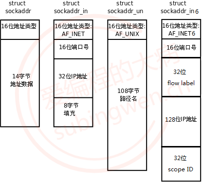

+ [author](https://github.com/3293172751)

# 第13节 sockaddr数据结构

+ [回到目录](../README.md)
+ [回到项目首页](../../README.md)
+ [上一节](12.md)
> ❤️💕💕计算机网络--TCP/IP 学习。Myblog:[http://nsddd.top](http://nsddd.top/)
---
[TOC]

## sockaddr 数据结构

**IPV4和IPV6所需要的结构体是不一样的。**





```c
//早期的sockaddr -- 不方便
struct sockaddr {
	sa_family_t sa_family;       //地址族协议 IP v4   
	char        sa_data[14];     //端口（2字节）+IP地址（4字节）+填充（8字节）
}

typedef unsigned short  uint16_t;
typedef unsigned int    uint32_t;
typedef uint16_t in_port_t;
typedef uint32_t in_addr_t;
typedef unsigned short int sa_family_t;
#define __SOCKADDR_COMMON_SIZE (sizeof (unsigned short int))


struct in_addr
{
    in_addr_t s_addr;   //地址
};  

struct sockaddr_in	//IPv4的sockaddr
{
	uint8_t 		sin_len;	/* length of structure (16字节) */
	sa_family_t 	sin_family;	/* AF_INET */
	in_port_t 		sin_port;	// 16-bit TCP or UDP port number; 网络字节序 ==> 大端 
	struct in_addr 	sin_addr;	/* 32-bit IPv4 address; 网络字节序  */
	char			sin_zero[8];/* unused */
};
```


## 套接字函数

### socket()

使用套接字通信函数需要包含头文件 `<arpa/inet.h>`，包含了这个头文件 `<sys/socket.h>` 就不用在包含了。

```
int socket(int domain, int type, int protocol);
```

- 参数:
  - domain: 使用的地址族协议
    - AF_INET: 使用 IPv4 格式的 ip 地址
    - AF_INET6: 使用 IPv4 格式的 ip 地址
  - type:
    - SOCK_STREAM: 使用流式的传输协议
    - SOCK_DGRAM: 使用报式 (报文) 的传输协议
  - protocol: 一般写 0 即可，使用默认的协议
    - SOCK_STREAM: 流式传输默认使用的是 tcp
    - SOCK_DGRAM: 报式传输默认使用的 udp
- 返回值:
  - 成功：可用于套接字通信的文件描述符
  - 失败: -1

函数的返回值是一个文件描述符，通过这个文件描述符可以操作内核中的某一块内存，网络通信是基于这个文件描述符来完成的。


----

> 一个问题： 在一个程序中能打开多少个socket？
>
> **一个程序里面打开的socket`1024`**个，我们可以用`ulimit -a`查看
>
> 
>
> 我们可以对其修改(**在后面做高并发的程序设计的时候需要了解到**)
>
> ```
> ulimit -HSn 2000
> ```


### bind()

```
int bind(int sockfd, const struct sockaddr *addr, socklen_t addrlen);
```

- 参数:
  - sockfd: 监听的文件描述符，通过 socket () 调用得到的返回值
  - addr: 传入参数，要绑定的 IP 和端口信息需要初始化到这个结构体中，`IP和端口要转换为网络字节序`
  - addrlen: 参数 addr 指向的内存大小，sizeof (struct sockaddr)
- 返回值：成功返回 0，失败返回 - 1


### listen()

```
int listen(int sockfd, int backlog);
```

- 参数:
  - sockfd: 文件描述符，可以通过调用 socket () 得到，在监听之前必须要绑定 bind ()
  - backlog: 同时能处理的最大连接要求，最大值为 128
- 返回值：函数调用成功返回 0，调用失败返回 -1


### accept()

```
int accept(int sockfd, struct sockaddr *addr, socklen_t *addrlen);
```

- 参数:
  - sockfd: 监听的文件描述符
  - addr: 传出参数，里边存储了建立连接的客户端的地址信息
  - addrlen: 传入传出参数，用于存储 addr 指向的内存大小
- 返回值：函数调用成功，得到一个文件描述符，用于和建立连接的这个客户端通信，调用失败返回 -1

> `sockfd`这个函数是一个阻塞函数，当没有新的客户端连接请求的时候，该函数阻塞；当检测到有新的客户端连接请求时，阻塞解除，新连接就建立了，得到的返回值也是一个文件描述符，基于这个文件描述符就可以和客户端通信了。


### read()和recv()

```c
ssize_t read(int sockfd, void *buf, size_t size);
ssize_t recv(int sockfd, void *buf, size_t size, int flags);
```

- 参数:
  - sockfd: 用于通信的文件描述符，accept () 函数的返回值
  - buf: 指向一块有效内存，用于存储接收是数据
  - size: 参数 buf 指向的内存的容量
  - flags: 特殊的属性，一般不使用，指定为 0
- 返回值:
  - 大于 0：实际接收的字节数
  - 等于 0：对方断开了连接
  - -1：接收数据失败了


### write()和send()

> 如果连接没有断开，接收端接收不到数据，接收数据的函数会阻塞等待数据到达，数据到达后函数解除阻塞，开始接收数据，当发送端断开连接，接收端无法接收到任何数据，但是这时候就不会阻塞了，函数直接返回0。

```
ssize_t write(int fd, const void *buf, size_t len);
ssize_t send(int fd, const void *buf, size_t len, int flags);
```

- 参数:
  - fd: 通信的文件描述符，accept () 函数的返回值
  - buf: 传入参数，要发送的字符串
  - len: 要发送的字符串的长度
  - flags: 特殊的属性，一般不使用，指定为 0
- 返回值：
  - 大于 0：实际发送的字节数，和参数 len 是相等的
  - -1：发送数据失败了


### connect()

```
int connect(int sockfd, const struct sockaddr *addr, socklen_t addrlen);
```

- 参数:
  - sockfd: 通信的文件描述符，通过调用 socket () 函数就得到了
  - addr: 存储了要连接的服务器端的地址信息: iP 和 端口，这个 IP 和端口也需要转换为大端然后再赋值
  - addrlen: addr 指针指向的内存的大小 sizeof (struct sockaddr)
- 返回值：连接成功返回 0，连接失败返回 - 1


### clone()

**查询man文档**

```
man clone 
```


## END 链接
+ [回到目录](../README.md)
+ [上一节](12.md)
+ [下一节](14.md)
---
+ [参与贡献❤️💕💕](https://github.com/3293172751/CS_COURSE/blob/master/Git/git-contributor.md)
