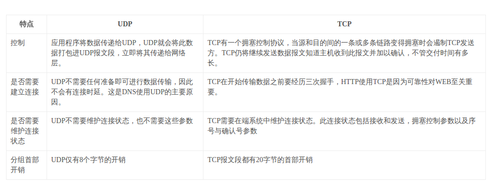

+ [author](https://github.com/3293172751)

# 第3节 应用层—协议

+ [回到目录](../README.md)
+ [回到项目首页](../../README.md)
+ [上一节](2.md)
> ❤️💕💕计算机网络--TCP/IP 学习。Myblog:[http://nsddd.top](http://nsddd.top/)
---
[TOC]

## 应用层协议的结构与分类应用

**相对于之前的P2P或者CS架构，现在有一个NDN（信息命名网络）：和现在以host为master，NDN是以内容为中心的，**

+ 数据命名
+ 每个数据包安全
+ 按照兴趣条转化

### 传统的架构

+ 应用程序体系结构包括**CS 客户端-服务器架构**和**P2P体系结构**

+ P2P体系结构

  + p2p是对等网络，每个结点既可以是服务端也可以是客户端，这种对等通信不必通过专门的服务器，该体系结构被称为对等方到对等方。
  + p2p体系结构最引人入胜的特性之一就是它们的**自扩展性**
  + 未来的p2p应用于**高度非集中式结构，面临安全性、性能和可靠性等挑战。**

  

+ 客户端-服务器架构

  * 发起通信的进程叫客户
  * 等待联系的进程叫服务器
  * 发送和接受报文的接口叫套接字
    * 套接字是同一个主机内应用层和传输层的接口
    * 套接字也称之为应用程序和网络之间的**应用程序编程接口（API）**
    * 开发者可以通过控制API在应用层的一切，**但是对该API的传输层端几乎没有控制权**，只有：
      1. 选择传输层协议
      2. 或许能设定几个传输层参数（如最大缓存或者最大报文字段长度）
  * 通过IP来寻得主机，端口号区分主机上的不同应用程序

  

## 因特网提供的运输服务

### 因特网应用需求

### TCP服务

#### 特点

1. **面向连接**：发送报文之前经过三次握手，然后建立一条**全双工**连接，发送报文，再销毁连接
2. **可靠**：非常可靠，没有字节丢失和冗余
3. **有拥塞机制**：不一定给自己带来好处，但对整个网络环境友好
4. `TCP`不安全，但有自己的加强版——`SSL`协议
   + HTTPS最开始使用的加密协议就是SSL协议

### UDP服务

#### 特点

1. **轻量级**：最小化服务，最小化成本
2. 不可靠：可能发送包丢失和乱序
3. **没有拥塞机制**：可以以任何速率向网络层注入数据
4. 无需握手

### 注意

不管是`UDP`还是`TCP`，都不提供弹性带宽（吞吐量）保证和时间敏感保证。

### 对比

### 应用层支持的运输层表

## END 链接
+ [回到目录](../README.md)
+ [上一节](2.md)
+ [下一节](4.md)
---
+ [参与贡献❤️💕💕](https://github.com/3293172751/CS_COURSE/blob/master/Git/git-contributor.md)
