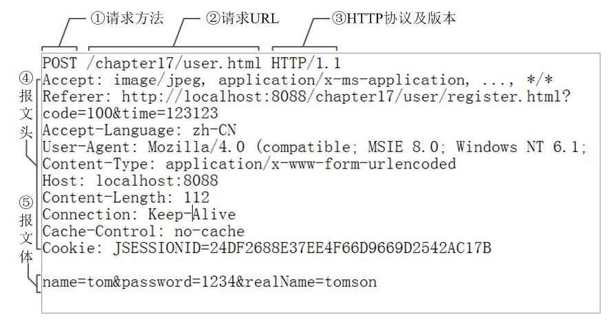
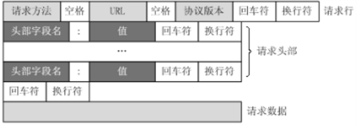
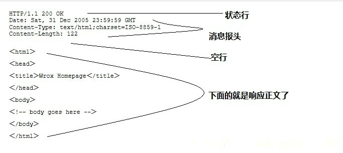

+ [author](https://github.com/3293172751)

# 第4节 HTTP协议

+ [回到目录](../README.md)
+ [回到项目首页](../../README.md)
+ [上一节](3.md)
> ❤️💕💕计算机网络--TCP/IP 学习。Myblog:[http://nsddd.top](http://nsddd.top/)
---
[TOC]

## HTTP协议

### 一些web术语和基本概念、约定

+ web文档是由对象组成的。一个对象就是一个文件。对象一般由`URL`来定位。
+ URL：统一资源定位符，主要由两部分组成：一部分是主机名，另一部分是对象们的路径名，是因特网上标准的资源的地址

$$
protocol :// hostname[:port] / path / [;parameters][?query]\#fragment
$$

### URL格式解析

#### protocol(协议)：

指定使用的传输协议，下面也列出了几种 protocol 属性的有效方案名称。那我们最常用的就是 HTTP 协议，它也是目前 www 中应用最广泛的协议。
file 资源是本地计算机上的文件。格式 file:///，注意后边应是三个斜杠。
ftp 通过 FTP 访问资源。格式 FTP://
gopher 通过 Gopher 协议访问该资源。
http 通过 HTTP 访问该资源。 格式 HTTP://
https 通过安全的 HTTPS 访问该资源。 格式 HTTPS://
mailto 资源为电子邮件地址，通过 SMTP 访问。 格式 mailto:

#### hostname(主机名)

是指存放资源的服务器的域名系统 (DNS) 主机名或 IP 地址。有时，在主机名前也可以包含连接到服务器所需的用户名和密码（格式：username:password@hostname）。

#### port(端口号)

整数，可选，省略时使用方案的默认端口，各种传输协议都有默认的端口号，如 http 的默认端口为 80。如果输入时省略，则使用默认端口号。有时候出于安全或其他考虑，可以在服务器上对端口进行重定义，即采用非标准端口号，此时，URL 中就不能省略端口号这一项。

#### path（路径）

由零或多个 “/” 符号隔开的字符串，一般用来表示主机上的一个目录或文件地址。
parameters（参数）
这是用于指定特殊参数的可选项。

#### parameters（参数）

这是用于指定特殊参数的可选项。

#### query(查询)

可选，用于给动态网页（如使用 CGI、ISAPI、PHP/JSP/ASP/ASP。NET 等技术制作的网页）传递参数，可有多个参数，用 “&” 符号隔开，每个参数的名和值用 “=” 符号隔开。

#### fragment（信息片断）

字符串，用于指定网络资源中的片断。例如一个网页中有多个名词解释，可使用 fragment 直接定位到某一名词解释。

#### URL 模块

URL 用于解析字符串和处理字符串，提供了三个方法

+ **parse** 方法
+ **format** 方法
+ **resolve** 方法


### HTTP概况

+ `HTTP`一般使用`TCP`作为传输层协议（但HTTP协议中并没有规定必须使用它或它支持的层）
+ `HTTP`是一个无状态协议：`HTTP`服务器不保存客户的任何信息。缺少状态意味着如果后续处理需要前面的信息，则它必须重传，这样可能导致每次连接传送的数据量增大。另一方面，在服务器不需要先前信息时它的应答就较快。
+ `HTTP`是一个无连接协议：限制每次连接只处理一个请求。服务器处理完客户的请求，并收到客户的应答后，即断开连接。采用这种方式可以节省传输时间。
+ `HTTP`是媒体独立的：这意味着，只要客户端和服务器知道如何处理的数据内容，任何类型的数据都可以通过HTTP发送。客户端以及服务器指定使用适合的MIME-type内容类型。

### HTTP非持久连接

+ `HTTP` 0.9和1.0使用非持续连接
+ 在非持续连接下每个tcp只连接一个web对象，连接在每个请求回应对后都会关闭

### HTTP持久连接

+ `HTTP` 1.1+默认使用持续连接 1.0要加`Keep-alive`相应头
+ 一个连接可被多个请求重复利用的保持连接机制被引入，显著地减少了请求延迟，因为客户不用在首次请求后再次进行TCP交互确认创建连接
+ 优点
  * 较少的CPU和内存的使用（由于同时打开的连接的减少了）
  * 允许请求和应答的HTTP管线化
  * 降低网络阻塞 （TCP连接减少了）
  * 减少了后续请求的延迟（无需再进行握手）
  * 报告错误无需关闭TCP连接
+ 缺点
  * 对于现在的广泛普及的宽带连接来说，Keep-Alive也许并不像以前一样有用。web服务器会保持连接若干秒(Apache中默认15秒)，这与提高的性能相比也许会影响性能。
  * 对于单个文件被不断请求的服务(例如图片存放网站)，Keep-Alive可能会极大的影响性能，因为它在文件被请求之后还保持了不必要的连接很长时间。

### HTTP请求报文格式

#### 请求报文

以下是一个典型的请求报文


可以解析为


#### 请求方法

+ `GET`		请求获取Request-URI所标识的资源
+ `POST`	在Request-URI所标识的资源后附加新的数据
+ `HEAD`请求获取由Request-URI所标识的资源的响应消息报头
+ `PUT`请求服务器存储一个资源，并用Request-URI作为其标识

+ `DELETE`请求服务器删除Request-URI所标识的资源
+ `TRACE`请求服务器回送收到的请求信息，主要用于测试或诊断
+ `CONNECT`保留将来使用
+ `OPTIONS`请求查询服务器的性能，或者查询与资源相关的选项和需求

#### 请求URL

+ 统一资源定位符的标准格式如下：  
  
  ```
  协议类型://服务器地址（必要时需加上端口号）/路径/文件名  
  ```
  
  
  
+ 而`HTTP`的统一资源定位符将从因特网获取信息的五个基本元素包括在一个简单的地址中：

1. 传送协议(http/https)。
2. 服务器。（通常为域名，有时为IP地址）
3. 端口号。（以数字方式表示，若为HTTP的预设值`:80`可省略）
4. 路径。（以“/”字元区别路径中的每一个目录名称）
5. 查询字符串(query string)。（GET模式的表单参数，以“?”字元为起点，每个参数以“&”隔开，再以“=”分开参数名称与资料，通常以UTF8的URL编码，避开字元冲突的问题）

#### 其他字段

+ Accept：浏览器可接受的MIME类型。
+ Accept-Charset：浏览器可接受的字符集。
+ Accept-Encoding：浏览器能够进行解码的数据编码方式，比如`gzip`。`Servlet`能够向支持`gzip`的浏览器返回经gzip编码的HTML页面。许多情形下这可以减少5到10倍的下载时间。
+ Accept-Language：浏览器所希望的语言种类，当服务器能够提供一种以上的语言版本时要用到。
+ Authorization：授权信息，通常出现在对服务器发送的WWW-Authenticate头的应答中。
+ Connection：表示是否需要持久连接。HTTP1.1默认是`keep-alive`
+ Content-Length：表示请求消息正文的长度。
+ Cookie：这是最重要的请求头信息之一
+ From：请求发送者的email地址，由一些特殊的Web客户程序使用，浏览器不会用到它。
+ Host：初始URL中的主机和端口。
+ If-Modified-Since：只有当所请求的内容在指定的日期之后又经过修改才返回它，否则返回304“Not Modified”应答。
+ Pragma：指定“no-cache”值表示服务器必须返回一个刷新后的文档，即使它是代理服务器而且已经有了页面的本地拷贝。
+ Referer：包含一个URL，用户从该URL代表的页面出发访问当前请求的页面。
+ User-Agent：浏览器类型，如果Servlet返回的内容与浏览器类型有关则该值非常有用。


### 用户与服务器的交互

#### cookie

**HTTP使用了cookie，它允许站点对用户进行跟踪。目前大多数商务web站点都使用了cookie**

+ 标识码
  $$
  Set-cookie:1678
  $$
  

#### web缓存

> 以空间换时间

web缓存也称之为代理服务器，它是能用代表初始的web服务器来满足HTTP请求的网络实体、web缓存有自己的磁盘存储空间，并且在存储空间中保存最近请求过的对象的副本。

+ web缓存器既是客户端也可以是服务端
  + 当它接受浏览器的请求并且发送回一个响应时，它是服务端
  + 当它向初始服务器发送出请求并且接收响应的时候，它是客户端
+ web缓存器的总响应时间：即一个浏览器请求对象到接收到一个对象的响应时间


#### 条件GET的方法

**HTTP有一种机制，它允许缓存器证实它的对象是最新的，这种请求机制叫做条件GET方法。**


### HTTP响应报文形式

#### 应答报文

HTTP响应由三个部分组成，分别是：状态行、消息报头、响应正文。以下是响应报文的基本形式：


#### 状态行

状态行格式如下：
$$
HTTP-Version Status-Code Reason-Phrase CRLF
$$
其中：  

+ HTTP-Version表示服务器HTTP协议的版本；
+ Status-Code表示服务器发回的响应状态代码；
+ Reason-Phrase表示状态代码的文本描述。
+ CRLF是换行

#### 响应码

状态代码有三位数字组成，第一个数字定义了响应的类别，且有五种可能取值：

+ 1xx：指示信息--表示请求已接收，继续处理
  * 100 Continue 客户端应当继续发送请求的剩余部分。服务器必须在请求完成后向客户端发送一个最终响应。
  * 101 Switching Protocols 服务器已经理解请求，并将通过Upgrade消息头通知客户端采用不同的协议来完成这个请求。在发送完这个响应最后的空行后，服务器将会切换到在Upgrade消息头中定义的那些协议。
+ 2xx：成功--表示请求已被成功接收、理解、接受
  * 204 No Content 服务器成功处理了请求，但不需要返回任何实体内容，并且希望返回更新了的元信息。响应可能通过实体头部的形式，返回新的或更新后的元信息。
  * 206 Partial Content 服务器已经成功处理了部分GET请求。类似于FlashGet或者迅雷这类的HTTP 下载工具都是使用此类响应实现断点续传或者将一个大文档分解为多个下载段同时下载。该请求必须包含Range头信息来指示客户端希望得到的内容范围，并且可能包含If-Range来作为请求条件。
+ 3xx：重定向--要完成请求必须进行更进一步的操作
  * 300 Multiple Choices 被请求的资源有一系列可供选择的回馈信息，用户或浏览器能够自行选择一个首选的地址进行重定向。
  * 301 Moved Permanently 被请求的资源已永久移动到新位置，将来任何对此资源的引用都应使用本响应返回的若干个URI之一。
+ 4xx：客户端错误--请求有语法错误或请求无法实现
  * 400 Bad Request 由于包含语法错误，当前请求无法被服务器理解。除非进行修改，否则客户端不应该重复提交这个请求。
  * 401 Unauthorized 当前请求需要用户验证。该响应必须包含一个WWW-Authenticate信息头用以询问用户信息。
  * 403 Forbidden 服务器已经理解请求，但是拒绝执行它。
  * 404 Not Found 请求失败，请求所希望得到的资源未被在服务器上发现。
  * 407 Proxy Authentication Required 与401响应类似，只不过客户端必须在代理服务器上进行身份验证。
  * 410 Gone 被请求的资源在服务器上已经不再可用，而且没有任何已知的转发地址。这样的状况应当被认为是永久性的。
  * 421 There are too many connections from your internet address 从当前客户端所在的IP地址到服务器的连接数超过了服务器许可的最大范围
  * 426 Upgrade Required 客户端应当切换到TLS/1.0。
+ 5xx：服务器端错误--服务器未能实现合法的请求
  * 500 Internal Server Error 服务器遇到状况，无法完成对请求的处理。一般来说，这个问题都会在服务器的程序码出错时出现。
  * 501 Not Implemented 服务器无法识别请求的方法，并且无法支持其对任何资源的请求。
  * 502 Bad Gateway 作为网关或者代理工作的服务器尝试执行请求时，从上游服务器接收到无效的响应。
  * 503 Service Unavailable 由于临时的服务器维护或者过载，服务器当前无法处理请求。
  * 504 Gateway Timeout 作为网关或者代理工作的服务器尝试执行请求时，未能及时从上游服务器（URI标识出的服务器，例如HTTP、FTP、LDAP）或者辅助服务器（例如DNS）收到响应。注意：某些代理服务器在DNS查询超时时会返回400或者500错误。

#### 消息报头

+ Location 响应报头域用于重定向接受者到一个新的位置。Location响应报头域常用在更换域名的时候。
+ Server响应报头域包含了服务器用来处理请求的软件信息。与User-Agent请求报头域是相对应的。
+ WWW-Authenticate 必须被包含在401（未授权的）响应消息中，客户端收到401响应消息时候，并发送Authorization报头域请求服务器对其进行验证时，服务端响应报头就包含该报头域。
+ Content-Encoding 它的值指示了已经被应用到实体正文的附加内容的编码，因而要获得Content-Type报头域中所引用的媒体类型，必须采用相应的解码机制。Content-Encoding这样用于记录文档的压缩方法，eg：Content-Encoding：gzip
+ Content-Language 实体报头域描述了资源所用的自然语言。没有设置该域则认为实体内容将提供给所有的语言阅读
  者。
+ Content-Length 实体报头域用于指明实体正文的长度，以字节方式存储的十进制数字来表示。
+ Content-Type实体报头域用语指明发送给接收者的实体正文的媒体类型。
+ Last-Modified实体报头域用于指示资源的最后修改日期和时间。
+ Expires实体报头域给出响应过期的日期和时间。


### get请求，post请求的区别：

​		1、GET使用URL或Cookie传参。而POST将数据放在BODY中。

　　2、GET的URL会有长度上的限制，则POST的数据则可以非常大。

　　3、POST比GET安全，因为数据在地址栏上不可见。

　　4、一般get请求用来获取数据，post请求用来发送数据。

> 其实上面这几点，只有最后一点说的是比较靠谱的，第一点post请求也可以把数据放到url里面，get请求其实也没长度限制，post请求看起来参数是隐式的，稍微安全那么一些些，但是那只是对于小白用户来说的，就算post请求，你通过抓包也是可以抓到参数的。（唯一区别就是这一点，上面3点区别都是不准确的）


### ssh and ssl

| **SSH**                                         | **SSL**                                                      |
| ----------------------------------------------- | ------------------------------------------------------------ |
| 用于安全和远程连接到另一台机器以发出命令。      | 用于在两方之间安全传输数据——通常是您网站的访问者和您网站的服务器。 |
| 基于网络隧道。                                  | 基于数字证书（即SSL证书）                                    |
| 在端口 22 上运行                                | 在端口 443 上运行                                            |
| 要求客户端使用用户名/密码或加密密钥进行身份验证 | 只需要在服务器端进行身份验证（客户端不需要进行身份验证）     |
| 是一种加密网络协议                              | 是一种安全协议                                               |


## END 链接

+ [回到目录](../README.md)
+ [上一节](3.md)
+ [下一节](5.md)
---
+ [参与贡献❤️💕💕](https://github.com/3293172751/CS_COURSE/blob/master/Git/git-contributor.md)
