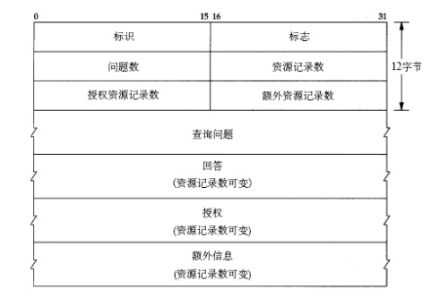

+ [author](https://github.com/3293172751)

# 第7节 DNS协议

+ [回到目录](../README.md)
+ [回到项目首页](../../README.md)
+ [上一节](6.md)
> ❤️💕💕计算机网络--TCP/IP 学习。Myblog:[http://nsddd.top](http://nsddd.top/)
---
[TOC]

## DNS协议

+ [在线解析地址](https://tool.chinaz.com/dns/?type=1&host=wt.nsddd.top&ip=)

### 术语与约定

+ **域名系统**（**DNS**）是互联网的一项服务。它作为将域名和IP地址相互映射的一个**分布式数据库**，能够使人更方便地访问互联网。
+ DNS使用TCP和UDP端口53。
+ DNS每一级域名长度的限制是63个字符，域名总长度则不能超过253个字符。

### dns概述

+ dns用于转换主机名和IP地址。
+ 它是应用层协议，体现在：
  + 是C/S架构
  + 端到端发送dns报文
+ 与其他应用层协议不同的是，dns主要为其他应用层协议服务，而不是直接面向用户。

### dns记录了什么

+ 主机记录（A记录）：用于名称解析的重要记录，将特定的主机名映射到对应主机的IP地址上。
+ 别名记录（CNAME记录）: 将某个别名指向到某个A记录上，这样就不需要再为某个新名字另外创建一条新的A记录。
+ IPv6主机记录（AAAA记录）: 用于将特定的主机名映射到一个主机的IPv6地址。
+ 服务位置记录（SRV记录）: 用于定义提供特定服务的服务器的位置，如主机（hostname），端口（port number）等。
+ NAPTR记录：提供了正则表达式方式去映射一个域名。NAPTR记录非常著名的一个应用是用于[ENUM](https://zh.wikipedia.org/w/index.php?title=ENUM&action=edit&redlink=1)查询。
+ MX记录：记录邮件服务器的别名。某公司的web服务器可以和邮件服务器共享别名。
+ NS记录：记录从哪个dns服务器可以获得某个域(如foo.com)的dns记录，即用于记录查询链。

### dns提供的服务

+ 映射域名与IP地址，并提供别名
+ 为邮件服务器提供别名
+ 负载分配(一个域名多个IP的时候)

### dns域名解析详解

> dns整体的工作主要围绕在主机和IP地址映射上面

DNS查询有两种方式：**递归**和**迭代**。DNS客户端设置使用的DNS服务器一般都是递归服务器，它负责全权处理客户端的DNS查询请求，直到返回最终结果。而DNS服务器之间一般采用迭代查询方式。

+ 从请求主机到DNS服务器是递归查询
+ 除此之外，其余的查询都是迭代查询

以查询zh.wikipedia.org为例：

- 客户端发送查询报文"query zh.wikipedia.org"至DNS服务器，DNS服务器首先检查自身缓存，如果存在记录则直接返回结果。
- 如果记录老化或不存在，则
  1. DNS服务器向[根域名服务器](https://zh.wikipedia.org/wiki/%E6%A0%B9%E5%9F%9F%E5%90%8D%E4%BC%BA%E6%9C%8D%E5%99%A8)发送查询报文"query zh.wikipedia.org"，根域名服务器返回.org域的权威域名服务器地址，这一级首先会返回的是[顶级域名](https://zh.wikipedia.org/wiki/%E9%A1%B6%E7%BA%A7%E5%9F%9F%E5%90%8D)的权威域名服务器。
  2. DNS服务器向.org域的权威域名服务器发送查询报文"query zh.wikipedia.org"，得到.wikipedia.org域的权威域名服务器地址。
  3. DNS服务器向.wikipedia.org域的权威域名服务器发送查询报文"query zh.wikipedia.org"，得到主机zh的A记录，存入自身缓存并返回给客户端。

> + 域名的划分是在逻辑上的划分
>
> + 网络的划分则是物理上的划分

### dns工作机制特性

**为了解决扩展性问题（集中式架构不易扩展），DNS使用了大量的DNS服务器，它们以层次方式组织（解决重名），并且分布在全世界的范围内，没有一台DNS服务器拥有因特网上所有主机的映射。**

+ dns具有分布式分层次解构
+ dns能够缓存

### dns记录与报文

#### dns记录

dns记录往往由四部分组成。

1. Type：标志这是一条什么记录，见[dns记录了什么](#dns记录了什么)
2. Value：Name的对应值
3. Name：Value的对应值
4. TTL：本记录应该在缓存中呆多久

### dns报文

 

1. 前12字节为**首部域**包括
   + 标识符(16bit数字)：查询的唯一标识
   + 标志(0 or 1)：0是查询 1是回答
2. 查询问题区包括
   + 名字字段：主机名
   + 类型：想查什么记录
3. 回答区：根据问题来回答，可能由多个回答
4. 授权区即权威区，包含其他权威服务器的记录
5. 附加区是一些备注信息

#### 注册dns 

我们需要向DNS数据库中插入数据

应该向注册登记机构注册自己的网络域名和IP地址，才能被查询到。

### dns的安全性

dns大多数情况下是安全的。

1. 对于`DDos`攻击，DNS有包过滤系统和缓存服务，仅在`DDos`攻击指向顶级服务器的时候稍微有些困扰。
2. 可以被中间人攻击(伪造回答哄骗客户主机)和DNS毒害攻击(伪造回答哄骗下一级dns服务器来缓存，从而欺骗客户主机)，但是技术上很难实现。
3. dns服务器本身可被利用于攻击其他服务器，但是至今为止只是个例。

## END 链接
+ [回到目录](../README.md)
+ [上一节](6.md)
+ [下一节](8.md)
---
+ [参与贡献❤️💕💕](https://github.com/3293172751/CS_COURSE/blob/master/Git/git-contributor.md)
